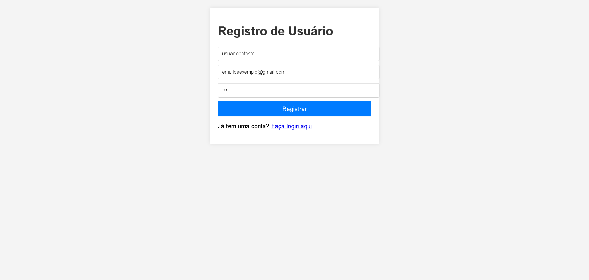
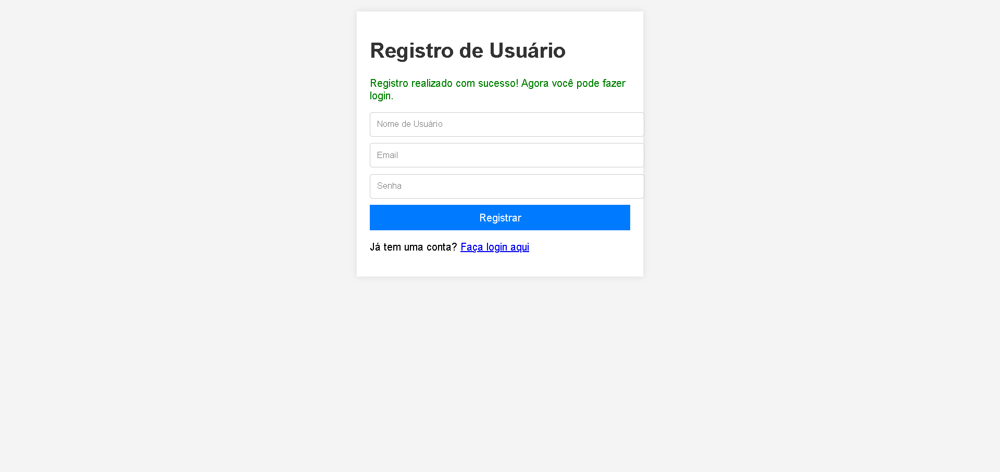
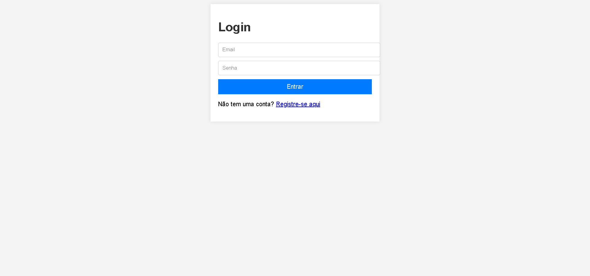
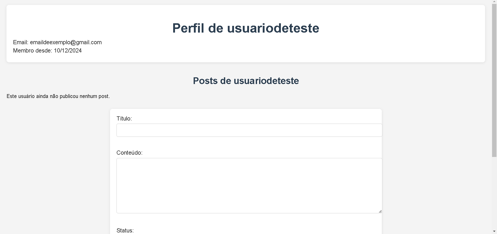
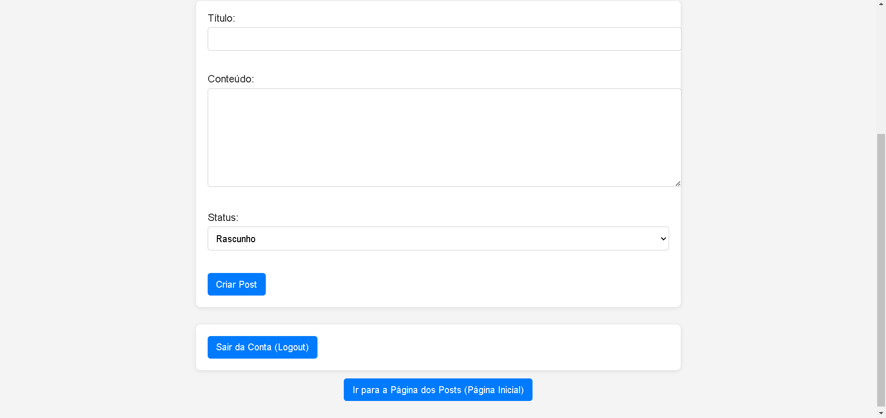

# Blog PHP com Docker

Este é um projeto de blog simples desenvolvido em PHP, com integração ao MySQL. O ambiente de desenvolvimento e execução é configurado usando Docker, facilitando o uso e a configuração do projeto em qualquer máquina.

## Funcionalidades

- **Login de usuário**: Sistema de autenticação para que os usuários possam acessar seu perfil.
- **Criar posts**: Usuários autenticados podem criar posts com título, conteúdo e status (rascunho ou publicado).
- **Visualizar posts**: Exibição de posts criados pelo usuário, com informações sobre o título, conteúdo e data de publicação.
- **Excluir posts**: Funcionalidade de exclusão de posts, com confirmação antes de realizar a exclusão.

## Requisitos

- **Docker**: 20.10 ou superior
- **Docker Compose**: 1.29 ou superior

## Instalação

### Passo 1: Clonar o repositório

Clone este repositório em seu ambiente de desenvolvimento:

```bash
git clone https://github.com/seu-usuario/blog-php.git
cd blog-php
```

### Passo 2: Configurar o Docker

Certifique-se de ter o Docker e o Docker Compose instalados. Caso não tenha, siga as instruções de instalação na documentação do Docker e Docker Compose.

O arquivo `docker-compose.yml` já está configurado para executar os contêineres do PHP e MySQL. Para inicializar o ambiente, execute o seguinte comando:

```bash
docker-compose up -d
```

Esse comando cria e inicia os contêineres do PHP e MySQL em segundo plano.

### Passo 3: Configurar o Banco de Dados

Após iniciar os contêineres, o banco de dados MySQL estará disponível e pode ser configurado. Utilize o terminal do MySQL dentro do contêiner ou qualquer cliente MySQL externo para configurar o banco de dados.

Acesse o contêiner do MySQL:

```bash
docker exec -it blog-php-mysql bash
```

Acesse o MySQL:

```bash
mysql -u root -p
```

Digite a senha quando solicitado (a senha é definida no arquivo `docker-compose.yml`).

Crie o banco de dados:

```sql
CREATE DATABASE blogphp;
```

Importe o esquema do banco de dados, caso tenha um arquivo `db_schema.sql`:

```bash
source /caminho/para/o/arquivo/db_schema.sql;
```

Configure as credenciais no arquivo `app/db.php`:

```php
<?php
$host = 'mysql';  // Nome do serviço MySQL no docker-compose
$db = 'blogphp';  // Nome do banco de dados
$user = 'root';   // Usuário MySQL (root por padrão)
$pass = 'senha';  // Senha do MySQL definida no docker-compose
```

### Passo 4: Acessando o Projeto

Após configurar o banco de dados, acesse a aplicação em seu navegador.

O PHP está disponível na porta 80 do seu ambiente Docker, então basta acessar:

```
http://localhost
```

## Estrutura de Arquivos

```
/blog-php
    /app
        db.php                # Configurações de conexão com o banco de dados
        index.php             # Página de entrada do blog
        login.php             # Página de login
        posts.php             # Página para exibir posts (em desenvolvimento)
        registro.php          # Página de registro do usuário
        user.php              # Página de perfil do usuário
    docker-compose.yml        # Arquivo de configuração do Docker
    Dockerfile                # Arquivo para configurar a imagem Docker do PHP
    README.md                 # Este arquivo
```

## Uso

### Criar Usuário e Logar

- Acesse a página de login (`login.php`) e faça login com um usuário existente ou crie um novo usuário no banco de dados.
- Após o login, você será redirecionado para o painel do usuário, onde pode criar, visualizar e excluir posts.

### Criar Post

- Na página de perfil do usuário (`user.php`), você pode criar um novo post, inserindo o título, conteúdo e status do post (rascunho ou publicado).
- O post será inserido no banco de dados e estará visível na lista de posts do usuário.

### Excluir Post

- Na lista de posts, você verá um botão para excluir posts. 
- Ao clicar, será exibida uma mensagem de confirmação antes de a exclusão ser realizada.

## Docker Compose

O arquivo `docker-compose.yml` contém a configuração para os contêineres necessários para rodar o projeto, incluindo PHP e MySQL. O arquivo pode ser ajustado de acordo com a sua necessidade.

Exemplo de `docker-compose.yml`:

```yaml
version: '3.8'

services:
  php:
    image: php:7.4-apache
    container_name: blog-php
    volumes:
      - ./app:/var/www/html
    ports:
      - "80:80"
    networks:
      - blogphp-network
    depends_on:
      - mysql

  mysql:
    image: mysql:5.7
    container_name: blog-php-mysql
    environment:
      MYSQL_ROOT_PASSWORD: senha
      MYSQL_DATABASE: blogphp
    volumes:
      - mysql-data:/var/lib/mysql
    networks:
      - blogphp-network

networks:
  blogphp-network:
    driver: bridge

volumes:
  mysql-data:
    driver: local
```
# Fluxo do Sistema














## Contribuindo

Se você deseja contribuir com o projeto, siga as etapas abaixo:

1. Faça um fork deste repositório.
2. Crie uma nova branch (`git checkout -b feature-nome-da-feature`).
3. Faça suas alterações e faça commit (`git commit -am 'Adiciona nova funcionalidade'`).
4. Envie para o seu fork (`git push origin feature-nome-da-feature`).
5. Crie um pull request.

## Licença

Este projeto está licenciado sob a MIT License - consulte o arquivo LICENSE para mais detalhes.

---

Feito com ❤️ por Oséias